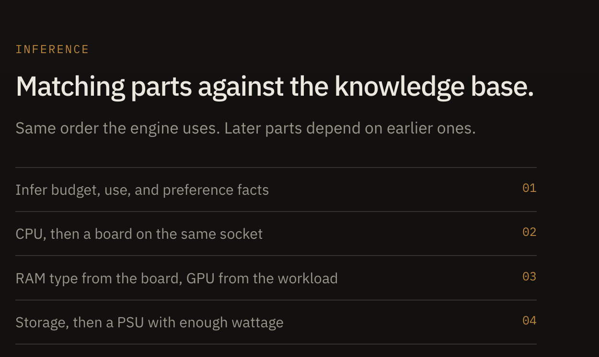
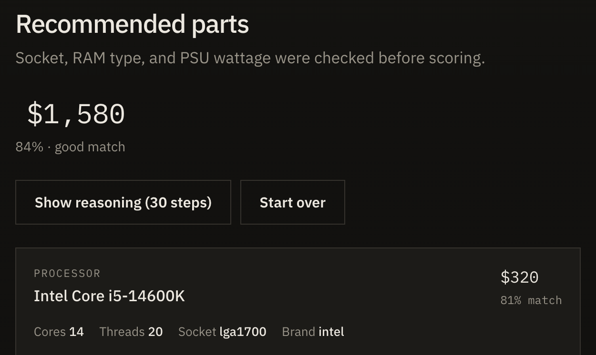

# PC Builder Expert System

An AI-powered PC building consultation system. It uses a Prolog-based expert system for reasoning and a React + Vite frontend for the UI.

## Overview

The system analyzes user requirements (budget, usage, preferences) and returns personalized PC build recommendations with confidence scores and an explanation trace.

## Documentation

- Assignment report (PDF): [`214164A - PC-Builder-Expert-System-Report.pdf`](./214164A%20-%20PC-Builder-Expert-System-Report.pdf)
- API specification: [`openAPI.yml`](./openAPI.yml)
- Detailed "How it works" guide: [`PCBuilderExpertSystem.md`](./PCBuilderExpertSystem.md)

## Architecture

- Backend: SWI-Prolog expert system with a simple HTTP server
- Frontend: React (Vite)

## Prerequisites

Both platforms need:

- **SWI-Prolog** 9.x or later (`swipl` on your PATH)
- **Node.js** 16+ (includes `npm`)

Download SWI-Prolog from [swi-prolog.org/download/stable](https://www.swi-prolog.org/download/stable) if you do not use a package manager.

### macOS

1. Install SWI-Prolog (pick one):

   - **Installer:** download the macOS disk image from the SWI-Prolog site, open it, and copy **SWI-Prolog.app** to `/Applications`. Then add it to your PATH:

     ```bash
     echo 'export PATH="/Applications/SWI-Prolog.app/Contents/MacOS:$PATH"' >> ~/.zshrc
     source ~/.zshrc
     ```

   - **Homebrew:**

     ```bash
     brew install swi-prolog
     ```

2. Install Node.js (pick one):

   ```bash
   brew install node
   ```

   Or download the macOS installer from [nodejs.org](https://nodejs.org/).

3. Check both tools:

   ```bash
   swipl --version
   node --version
   ```

### Windows

1. Install SWI-Prolog: download the Windows installer from the SWI-Prolog site and run it. Default location is `C:\Program Files\swipl\`.

2. Add Prolog to PATH (if `swipl` is not recognised):
   - Open **Settings → System → About → Advanced system settings → Environment Variables**
   - Edit **Path** (user or system) and add:

     ```text
     C:\Program Files\swipl\bin
     ```

   - Open a **new** Command Prompt or PowerShell window.

3. Install Node.js: download the Windows installer from [nodejs.org](https://nodejs.org/) (LTS) and run it. Tick the option that adds Node to PATH.

   Or with winget:

   ```powershell
   winget install OpenJS.NodeJS.LTS
   ```

4. Check both tools:

   ```powershell
   swipl --version
   node --version
   ```

## Installation & running

Clone the repo, then run the backend and frontend in **two terminals**.

```bash
git clone https://github.com/Thakshaka/expert-system.git
cd expert-system
```

### macOS / Linux (Terminal)

**Terminal 1 — backend**

```bash
cd backend
swipl -s server.pl -g "server, thread_get_message(keep_alive)"
```

**Terminal 2 — frontend**

```bash
cd frontend
npm install
npm run dev
```

### Windows (Command Prompt or PowerShell)

**Terminal 1 — backend**

```powershell
cd backend
swipl -s server.pl -g "server, thread_get_message(keep_alive)"
```

**Terminal 2 — frontend**

```powershell
cd frontend
npm install
npm run dev
```

Expected backend output:

```text
=== PC Builder Expert System ===
Server running on http://localhost:8080

Ready!
```

Vite serves the UI at **http://localhost:5173**. Open that URL in a browser. Keep both terminals open while you use the app.

## How it works

Answer a short questionnaire. Prolog infers extra facts, then picks a compatible CPU, motherboard, RAM, GPU, storage, PSU, and case.


### 1. Questions

Budget, primary use, gaming resolution (if needed), CPU brand, RGB, and cooling. One screen at a time.


### 2. Inference

The engine applies the rules in dependency order (CPU → board → RAM → GPU → storage → PSU → case).



### 3. Recommended build

You get a parts list with prices and match scores. **Why this part** explains a choice. **Alternatives** lets you swap a component. **Show reasoning** is the Prolog trace.



## Project Structure

The repository now contains a clear separation between the Prolog backend and the React frontend. Key files and folders are listed below.

```text
pc-builder-expert-system/
├── backend/                     # SWI-Prolog expert system
│   ├── server.pl                # HTTP server and main entry
│   ├── components.pl            # components, facts
│   ├── match.pl                 # Inference rules for compatibility and usage
│   ├── chaining.pl              # Forward chaining orchestration
│   ├── scoring.pl               # Component scoring logic
│   ├── recommend.pl             # Build recommendation driver
│   ├── confidence.pl            # Confidence calculation helpers
│   ├── explanations.pl          # Explanation / rationale generation
│   ├── handlers.pl              # HTTP handlers (endpoints)
│   ├── trace.pl                 # Trace capture utilities
│   ├── state.pl                 # Server state and session helpers
│   └── tiers.pl                 # Budget/tiers definitions

├── frontend/                    # React + Vite frontend
│   ├── package.json
│   ├── vite.config.js
│   └── src/
│       ├── App.jsx              # Main React app wiring
│       ├── main.jsx             # Vite entry point
│       ├── index.css
│       ├── assets/              # Images and static assets
│       └── components/
│           ├── pages/           # Page-level components
│           │   ├── HomePage.jsx
│           │   ├── QuestionsPage.jsx
│           │   ├── GeneratingPage.jsx
│           │   └── ResultsPage.jsx
│           └── shared/          # Reusable UI pieces
│               ├── Badge.jsx
│               ├── ComponentCard.jsx
│               ├── ExpertCard.jsx
│               ├── OptionCard.jsx
│               ├── PageLayout.jsx
│               └── SpecBox.jsx

├── docs/assignment/screenshots/ # UI screenshots used in this README
├── openAPI.yml                  # API specification for backend endpoints
├── 214164A - PC-Builder-Expert-System-Report.pdf
├── PCBuilderExpertSystem.md     # Detailed "How it works" guide
└── README.md
```

## Troubleshooting

- **`swipl` not found:** restart the terminal after installing. On macOS, confirm the PATH line in `~/.zshrc`. On Windows, confirm `C:\Program Files\swipl\bin` is on Path.

- **Backend won't start (port 8080 in use)**

  macOS / Linux:

  ```bash
  lsof -i :8080
  kill -9 <PID>
  ```

  Windows (PowerShell):

  ```powershell
  netstat -ano | findstr :8080
  taskkill /PID <PID> /F
  ```

- **Frontend can't connect to the backend:** the Prolog server must be running on port 8080. The UI calls `http://localhost:8080/api`. Check CORS in `server.pl` if you changed the host.

- **Server prints Ready! then exits:** start it with `-g "server, thread_get_message(keep_alive)"` as above (do not use `-t halt`).

Built with: SWI-Prolog • React • Vite
